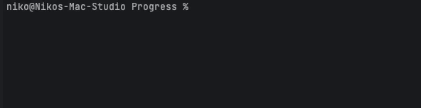

# Description

This is a simple wrapper around iterable variable with zero dependencies that uses generator to display progress in cli

## Installation

```shell
composer require nikop/progress
```

## Usage

```php
<?php

use Progress\Progress;

require __DIR__.'/../vendor/autoload.php';


foreach (new Progress(range(1, 4)) as $number) {
    foreach (new Progress(range(1, 5),'Second') as $secondNumber) {
        foreach (new Progress(range(1, 6), 'Third') as $thirdNumber) {
            {
                usleep(20000);
            }
        }
    }
}
```

### Result


